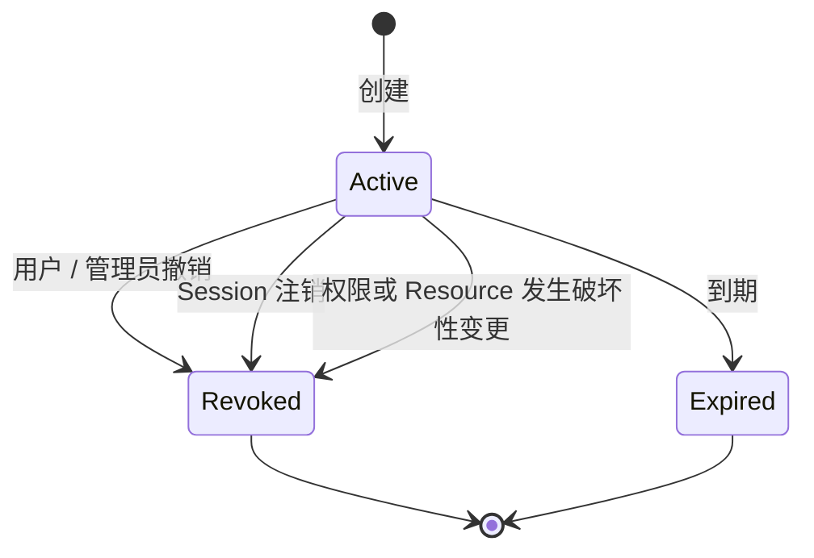

v0.1 使用 YAML 本地用户。每条 Access policy 列出 subject、Resource 与最大 TTL；**没有匹配规则就是拒绝**。

## 按组授权

```yaml
auth:
  provider: local
  local:
    users:
      "alice@example.com":
        password: "${ALICE_PASSWORD}"
        groups: [data]
      "bob@example.com":
        password: "${BOB_PASSWORD}"
        groups: [operations]

access:
  - subjects: ["group:data"]
    resources: [analytics]
    max_ttl: 30m
  - subjects: ["group:operations"]
    resources: [orders-api]
    max_ttl: 10m
```

subject 使用 `group:<name>` 或 `user:<email>`。同一用户匹配多条规则时，能访问匹配到的 Resource，但申请 TTL 不能超过对应策略上限。

## Lease 生命周期



Lease 绑定创建它的身份、Session、Resource、组快照、Agent ID、Task ID 和到期时间。它不能跨 Resource 使用，也不能通过修改请求头冒充另一身份。

## 为什么不在数据库里创建临时账号

不同数据库的账号生命周期、权限与协议差异很大。ByteHop 选择让上游看到稳定的最小权限服务身份，把临时性放在网关 Lease：

- 不需要给 ByteHop 创建用户的管理员权限；
- 不会因临时账号清理失败留下孤儿；
- ClickHouse、ES 与 HTTP API 使用同一授权模型；
- 代价是上游原生日志主要看到固定账号，需要用 ByteHop 的 request/query ID 关联到真实调用者。

## 身份变更

从 YAML 删除用户会禁用对应身份，并撤销其活动 Session 与 Lease。之后即使重新加入同名用户，旧 token 也不会恢复。密码变更同样要求旧会话失效。
