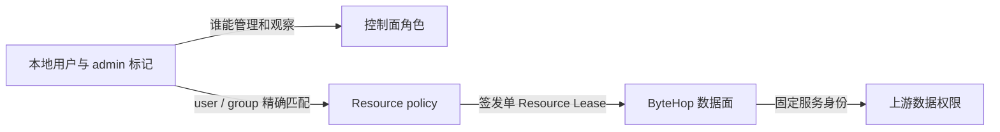
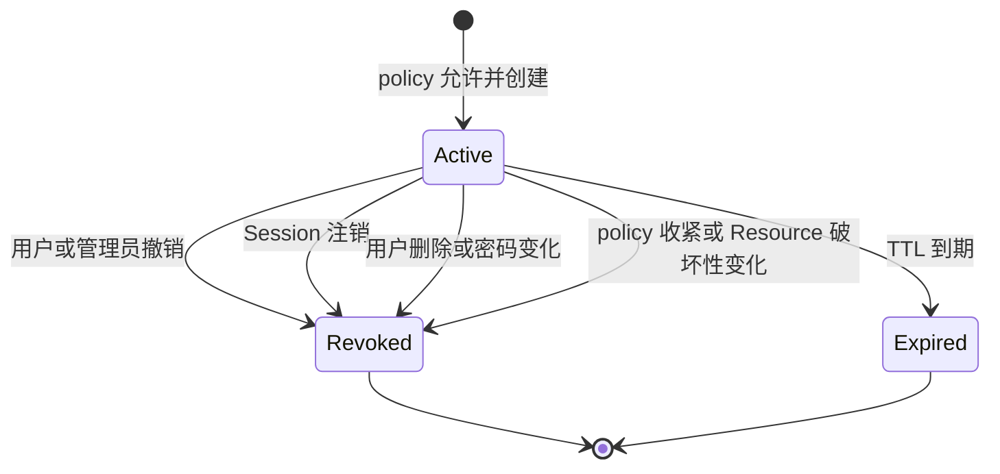

ByteHop 不用一个“管理员 / 普通用户”开关决定全部访问。管理能力、Resource 使用权和最终数据范围分别由三层规则决定。

先看一个具体例子：

| 登录身份 | ByteHop Access | Resource 绑定的上游身份 | 实际结果 |
| --- | --- | --- | --- |
| `alice@example.com` / `group:data` | `analytics` | ClickHouse `analytics_ro` | 只能查询该账号获准的库表 |
| `support@example.com` / `group:support` | `orders-api` | 内部 API `support_reader` | 只能执行该服务身份允许的订单查询 |
| `ops@example.com` / `admin: true` | 没有匹配的 Resource | 无 | 可以管理 ByteHop，但不能查询上述数据 |

一次请求随后经过三层权限检查：



1. **控制面角色**决定能看谁的 Session、Lease、Operation、Event，以及能否重载配置；
2. **Resource policy**决定这个身份能否发现某个 Resource、能否领取 Lease，以及最长多久；
3. **上游权限**决定固定服务身份最终能读哪些表、索引、集合或 API。

三层都要正确。`admin: true` 不会自动获得 Resource，也不会让高权限上游账号变安全。

## 控制面角色

| 能力 | 普通用户 | admin |
| --- | --- | --- |
| 登录 Web / CLI | 是 | 是 |
| 发现 Resource、创建 Lease | 仅匹配 Access policy | 仍然仅匹配 Access policy |
| 查看 Access policy | 仅与自己匹配的部分 | 全部 |
| 查看 Lease / Operation / Event | 仅自己的 | 全部用户 |
| 撤销 Lease、停止 Operation | 仅自己的 | 任意用户 |
| 配置 diff / reload | 否 | 是 |

因此可以设置一个**只管理、不查生产数据**的管理员：给他 `admin: true`，但不要让其 user / group 出现在任何生产 Resource policy 中。

## Resource policy

```yaml
auth:
  provider: local
  local:
    users:
      "alice@example.com":
        password_hash: "$2a$12$..."
        groups: [data]
      "oncall@example.com":
        password_hash: "$2a$12$..."
        groups: [operations]
        admin: true

access:
  - subjects: ["group:data"]
    resources: [analytics]
    max_ttl: 30m
  - subjects: ["group:operations"]
    resources: [orders-api]
    max_ttl: 10m
  - subjects: ["user:lead@example.com"]
    resources: [analytics]
    max_ttl: 1h
```

当前语义是确定的：

- subject 只支持 `user:<subject>` 与 `group:<name>`，均为精确匹配；
- 没有任何匹配规则就是拒绝；
- 规则是叠加的：一个身份可以通过多条规则获得多个 Resource；
- 同一 Resource 同时匹配多条规则时，采用其中**最大的 `max_ttl`**；
- 当前没有显式 `deny`，不能用后面的规则覆盖前面的允许；
- Lease 只绑定一个 Resource，不能拿 `analytics` 的 Lease 调 `orders-api`；
- 未填写 Lease TTL 时，实际值是 `default_lease_ttl` 与有效 policy 上限中较小的一个；
- 显式申请超过有效上限会失败，不会静默缩短。

<Callout type="warn" title="不要用宽规则再尝试排除个人">
  由于没有显式 deny，`group:data` 已经允许的 Resource 不能再通过另一条规则禁止某个用户。需要例外时，应调整用户组，或拆成更精确的组与 policy。
</Callout>

## 上游数据权限

ByteHop Resource policy 只决定“能不能使用这个入口”，不会解析 SQL、Elasticsearch DSL 或任意 HTTP 业务语义。真正的数据范围应由固定上游身份或受限 Bridge 落实。

| Resource | 上游最小权限放在哪里 | 典型限制 |
| --- | --- | --- |
| ClickHouse | user / role、Settings Profile、Constraint、Quota | database / table、只读、超时、内存、并发、结果规模 |
| Elasticsearch | role 或 API key | index pattern、read / view_index_metadata、必要的 cluster privilege |
| MongoDB HTTP Bridge | Bridge 的服务端配置与 MongoDB 用户 | database、collection、允许操作、projection、limit、timeout |
| 内部 HTTP API | API 自身的服务账号或专用 token | 业务动作、租户、对象范围、读写权限 |

如果数据范围不同，应创建不同上游身份并配置成不同 Resource。例如 `orders-summary` 和 `orders-sensitive`，而不是给 ByteHop 一个高权限账号后期待 Agent 自律。

## OpenAPI 与运行时权限

Resource 的 OpenAPI 用于发现操作和输入结构。运行时由 Resource policy、固定上游身份与 Bridge 控制可执行动作。通用 HTTP 与 Elasticsearch Resource 会拒绝 `CONNECT`、`TRACE` 和协议升级；ClickHouse 接受 `GET`、`POST`。

因此：

- 对已有 API，用专用上游身份限制可执行的业务动作；
- 对 MongoDB、CLI 或脚本，用小型 Bridge 只公开少量领域操作；
- 不要把“文档里没写这个 endpoint”当成访问控制。

完整协议行为见 [HTTP 转发规则](/docs/reference/http-behavior)。

## Lease 生命周期



Lease 绑定创建它的身份、Session、Resource、组快照、Agent ID、Task ID 和到期时间。原始 token 只在创建响应中出现一次，SQLite 只保存摘要。

## 修改权限时如何验证

1. 修改 YAML 后运行 `bytehop config check --config ./bytehop.yaml`；
2. 管理员运行 `bytehop config diff`，检查撤销影响；
3. 运行 `bytehop config reload` 原子应用；
4. 用目标用户身份运行 `bytehop resources --json`；
5. 同时验证一个应允许的 Resource 和一个应拒绝的 Resource；
6. 在 Web 的 **Access**、**Sessions** 与 **Events** 确认结果。

Access 收紧会撤销已经不再满足新 policy 的 Lease。删除用户或修改密码会撤销其 Session 与派生 Lease。更多操作见[用户管理](/docs/administration/member-lifecycle)和[安全热重载](/docs/administration/reload)。

<Callout title="当前身份方式">
  v0.1 使用 YAML 本地用户目录。每位使用者应使用独立账号，确保 Lease、Operation 与 Event 都能准确归属。
</Callout>
