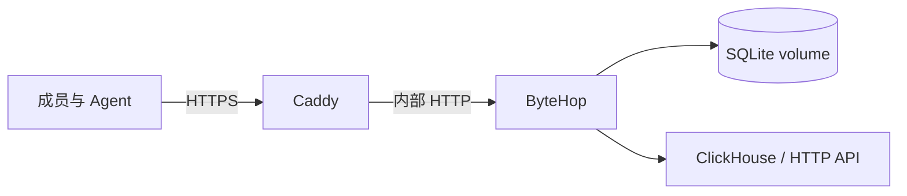

生产示例只启动两个长期服务：ByteHop 和 Caddy。Caddy 对外提供 HTTPS，ByteHop 只连接内部 Compose 网络，并把 SQLite 状态保存在独立 volume 中。



## 1. 准备主机

- 安装 Docker Engine 与 Docker Compose；
- 把域名解析到这台主机；
- 放行 TCP 80、TCP 443 和 UDP 443；
- 确认容器网络能访问上游；
- 在上游创建专用的最小权限账号。

## 2. 下载部署包

部署包与二进制由同一个 GitHub Release 生成：

```bash
VERSION=0.1.0
curl -fLO "https://github.com/rayui-lab/bytehop/releases/download/v${VERSION}/bytehop_${VERSION}_deployment.tar.gz"
curl -fLO "https://github.com/rayui-lab/bytehop/releases/download/v${VERSION}/SHA256SUMS"
grep "bytehop_${VERSION}_deployment.tar.gz" SHA256SUMS | sha256sum -c -
tar -xzf "bytehop_${VERSION}_deployment.tar.gz"
cd "bytehop_${VERSION}_deployment"
```

## 3. 填写环境变量

```bash
cp .env.example .env
chmod 600 .env
```

编辑 `.env`，至少设置：

- `BYTEHOP_DOMAIN` 与 `ACME_EMAIL`；
- 固定版本 `BYTEHOP_VERSION`；
- 随机生成的管理员密码；
- ClickHouse URL、只读用户名和密码。

配置文件中的 Secret 只写成 `${ENV_NAME}` 引用，不把真实值写进 YAML。

## 4. 检查并启动

```bash
docker compose config --quiet
docker compose pull
docker compose up -d --wait
```

Caddy 会自动申请并续期证书。ByteHop 容器以非 root 用户运行，根文件系统只读；只有 SQLite volume 可写。确认状态：

```bash
curl -fsS https://bytehop.example.com/healthz
docker compose exec bytehop /bytehop version
docker compose ps
```

默认管理员用户名是 `admin@example.com`，密码来自 `BYTEHOP_ADMIN_PASSWORD`。团队正式使用前，应在 `config/bytehop.yaml` 中加入每位成员的独立账号和明确的 Access policy。

## 修改配置

编辑 `config/` 目录后，先使用运行中容器的同一组环境变量校验：

```bash
docker compose exec bytehop \
  /bytehop config check --config /etc/bytehop/bytehop.yaml
```

再从已登录的管理员 CLI 预览和应用：

```bash
bytehop config diff
bytehop config reload
```

## 升级与回滚

备份 `config/` 和 `bytehop-data` volume，把 `.env` 中的 `BYTEHOP_VERSION` 改为经过确认的 Release，然后运行：

```bash
docker compose pull bytehop
docker compose up -d --wait bytehop
docker compose exec bytehop /bytehop version
```

回滚时恢复上一份配置和上一版本号，再执行相同命令。不要使用 `latest`，也不要在没有备份的情况下删除 Compose volume。

接下来按[生产部署清单](./production)检查用户权限、上游只读能力、备份和恢复。
