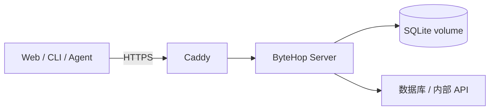

生产示例运行 ByteHop 和 Caddy。Caddy 对外提供 HTTPS，ByteHop 保存 SQLite 状态并访问上游数据库或 API。



整个首次部署只有三步：下载部署包、填写 `.env`、启动 Compose。

## 1. 下载部署包

主机需要 Docker Engine、Docker Compose 和指向这台主机的域名。把版本换成实际要部署的 Release：

```bash
VERSION=0.1.0
curl -fLO "https://github.com/rayui-lab/bytehop-dist/releases/download/v${VERSION}/bytehop_${VERSION}_deployment.tar.gz"
curl -fLO "https://github.com/rayui-lab/bytehop-dist/releases/download/v${VERSION}/SHA256SUMS"
grep "bytehop_${VERSION}_deployment.tar.gz" SHA256SUMS | sha256sum -c -
tar -xzf "bytehop_${VERSION}_deployment.tar.gz"
cd "bytehop_${VERSION}_deployment"
```

部署包已经包含 `compose.yaml`、Caddy 配置、`config/bytehop.yaml` 和 `.env.example`，不需要从零编写 Compose。

## 2. 填写 `.env`

```bash
cp .env.example .env
chmod 600 .env
```

只需要先确认这些值：

| 变量 | 填什么 |
| --- | --- |
| `BYTEHOP_DOMAIN` | 已解析到本机的域名 |
| `ACME_EMAIL` | TLS 证书通知邮箱 |
| `BYTEHOP_VERSION` | 固定的 ByteHop Release 版本 |
| `BYTEHOP_ADMIN_PASSWORD` | `openssl rand -base64 36` 生成的管理员密码 |
| `CLICKHOUSE_URL` | 首个只读 ClickHouse HTTP 地址 |
| `CLICKHOUSE_USERNAME` / `CLICKHOUSE_PASSWORD` | 上游预先创建的最小权限账号 |

示例默认创建 `admin@example.com` 和 `analytics` Resource。管理员密码是 ByteHop 登录密码；ClickHouse 密码只由 Server 使用，两者不要混淆。

如果首个资源不是 ClickHouse，先按[接入 Resource](/docs/administration/resource-onboarding)调整 `config/bytehop.yaml` 和 Compose 环境变量，再启动。

## 3. 启动并登录

```bash
docker compose config --quiet
docker compose pull
docker compose up -d --wait
```

确认 Server 可用：

```bash
curl -fsS https://bytehop.example.com/healthz
docker compose ps
```

然后打开 `https://bytehop.example.com`，使用以下信息登录：

```text
用户名：admin@example.com
密码：.env 中的 BYTEHOP_ADMIN_PASSWORD
```

至此 Server 已经部署完成。成员电脑不需要 Docker。

## 添加第一个普通用户

在 `.env` 增加用户密码，例如：

```dotenv
BYTEHOP_ALICE_PASSWORD=replace-with-another-random-password
```

在 `config/bytehop.yaml` 的 `auth.local.users` 中增加：

```yaml
"alice@example.com":
  password: "${BYTEHOP_ALICE_PASSWORD}"
  groups: [data]
  admin: false
```

生产 Compose 会把 `.env` 提供给 ByteHop 容器。新增或修改环境变量后重新创建 ByteHop 容器，让进程读取新值：

```bash
docker compose up -d --force-recreate bytehop
```

只有修改现有环境变量不涉及的 YAML 时，才可以使用管理员 CLI 执行无重启热更新：

```bash
docker compose exec bytehop \
  /bytehop config check --config /etc/bytehop/bytehop.yaml
bytehop config diff
bytehop config reload
```

完整账号流程见[用户管理](/docs/administration/member-lifecycle)。添加用户后，用其账号登录并运行 `bytehop resources`，同时确认一个应允许和一个应拒绝的 Resource。

## 交给团队使用

向成员提供 Server 地址、独立用户名、初始密码和已授权 Resource。成员从[第一次使用](/docs/quickstart)开始；不要把 `.env`、上游账号或整个 `bytehop.yaml` 发给成员。

## 升级与回滚

先备份 `config/` 和 `bytehop-data` volume，再修改 `.env` 中的 `BYTEHOP_VERSION`：

```bash
docker compose pull bytehop
docker compose up -d --wait bytehop
docker compose exec bytehop /bytehop version
```

回滚时恢复上一份配置和版本号，再执行相同命令。不要使用 `latest`，不要运行 `docker compose down --volumes`；该命令会删除 ByteHop SQLite 状态。

上线前继续完成[生产部署清单](/docs/administration/production)。
