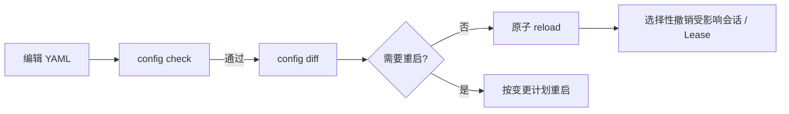

ByteHop 从启动时使用的同一 YAML 路径重读配置。`diff` 和 `reload` 不上传 YAML，因此 secret 不会经过控制 API。

## 推荐流程

```bash
bytehop config check --config ./bytehop.yaml
bytehop config diff
bytehop config reload
```

Web 管理员也可在 **System** 完成差异预览与重载。



## 可以在线应用

- Resource 描述、OpenAPI、health path；
- upstream、credential 与 Resource TLS；
- 本地用户、密码、组和管理员标记；
- Access policy 与默认 TTL 等运行配置。

重载会保留不受影响的 Session、Lease 和运行中请求。upstream / credential / Resource TLS 变化或 Resource 删除会撤销该 Resource 的旧 Lease；权限收紧只撤销不再满足策略的 Lease；用户删除或密码变化会撤销该用户的会话链。

## 需要重启

- `server.listen`、`public_url`；
- `data_dir`、`web_dir`；
- 内建 TLS 证书 / 密钥路径；
- `allow_insecure_http`。

若 diff 含这些字段，`reload` 返回 `restart_required`，整份配置不会被部分应用。

## 重载期间

listener 保持在线。新登录、新 Lease 和尚未开始的数据面请求可能短暂收到 `config_reloading`，这是可重试错误；已在运行且未受破坏性变更影响的请求继续执行。
