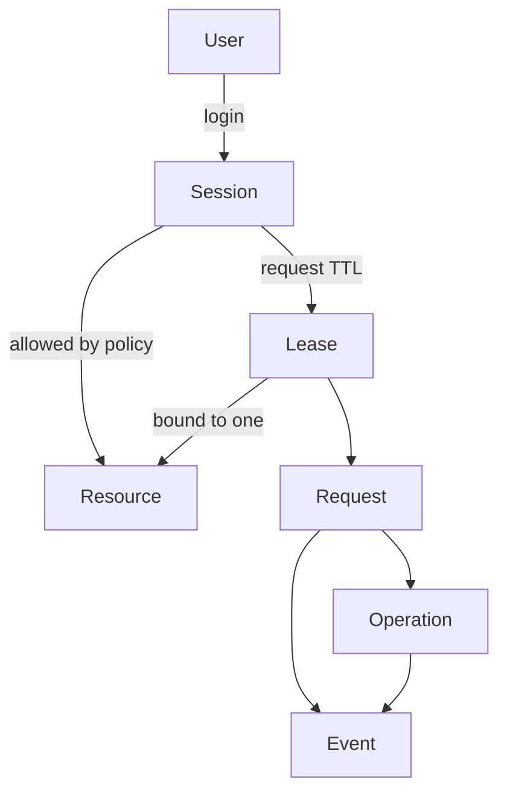
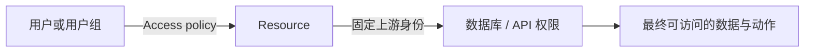

理解六个对象就能读懂 ByteHop 的配置、CLI 和 Web：用户先用 Session 进入控制面，再为获准的 Resource 获得短期 Lease；每次请求会形成运行中的 Operation，并在结束后留下 Event。

| 对象 | 含义 | 关键特性 |
| --- | --- | --- |
| Session | 用户登录后的控制面会话 | CLI 为 Bearer；Web 为 HttpOnly Cookie |
| Resource | 网关对外提供的一个能力 | 绑定一个上游入口、一套固定最小权限身份、类型和可选调用契约 |
| Lease | 从 Session 派生的短期能力 | 绑定一个用户和一个 Resource，可到期或撤销 |
| Request | 对资源的一次 HTTP 请求 | 带 `request_id`，可关联 Agent 与 Task |
| Operation | 当前网关进程正在代理的请求 | 可查看和单独停止；ClickHouse 额外显示 SQL 与 `query_id` |
| Event | 请求完成后的排障记录 | 保存身份、Resource、状态、耗时等元数据；ClickHouse 可保存有界 SQL |

ByteHop Skill 不是第七个服务端对象。它安装在 Agent 一侧，只负责把自然语言任务转换成正确的配置与 CLI 流程；不会保存 Session、签发 Lease 或决定权限。这样更换 Codex、Claude 或 Hermes 时，Gateway 的身份与数据面模型无需变化。

## Resource 是权限单元

一个 Resource 只绑定一套固定上游身份。Access policy 决定“哪个用户可以调用这个 Resource”，上游账号或 API 决定“最终能读哪些表、索引、集合或业务对象”。

如果同一个 ClickHouse 需要提供两种数据范围，应创建两个上游只读身份和两个 Resource，例如 `analytics-full` 与 `analytics-summary`。ByteHop 不把一个高权限账号交给所有 Agent，再依靠提示词约束 SQL。

## Session 与 Lease 不一样

Session 用于发现资源、申请或撤销 Lease、查看状态。Lease 只允许访问一个具体 Resource。即使拿到 `analytics` 的 Lease，也不能拿它调用 `orders-api`。

Web 登出会撤销从该 Session 派生的 Lease；Lease 到期后也不再可用。CLI 可以给每次请求附加 `agent_id`、`task_id`、`source_platform` 与 `source_user_id`，让同一个用户的不同 Agent、对话和消息来源仍可区分。Hermes 工具进程中的这些信息会被 CLI 自动关联，不需要修改 Gateway 配置。

这些来源字段是关联信息，不是登录身份。权限只看 ByteHop 认证得到的用户或服务身份，以及服务端 Access policy。

## 固定身份与临时身份

临时的是 ByteHop Lease，不是数据库账号。部署者先在 ClickHouse、Elasticsearch 或下游 API 里配置长期存在、权限足够小的服务身份，再把它放入 ByteHop 配置。这样不需要为每种协议重复实现“创建临时用户”，也避免把高权限管理员凭证交给网关。

## Event 能回答什么

Event 适合回答“谁、何时、通过哪个 Agent 和对话、从哪个消息来源访问了哪个资源、结果如何、关联哪个请求”。ClickHouse 请求还可记录去除数据区后的 SQL 文本；通用请求保存元数据和安全处理后的操作摘要。
