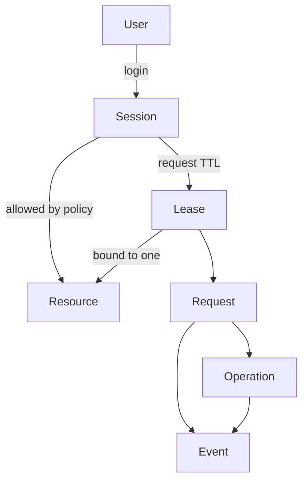

理解六个对象就能使用和运维 ByteHop。

| 对象 | 含义 | 关键边界 |
| --- | --- | --- |
| Session | 用户登录后的控制面会话 | CLI 为 Bearer；Web 为 HttpOnly Cookie |
| Resource | 一个可被访问的能力 | 包含上游、凭证、契约和类型，不等于整台服务器 |
| Lease | 从 Session 派生的短期能力 | 绑定一个用户和一个 Resource，可到期或撤销 |
| Request | 对资源的一次 HTTP 请求 | 带 `request_id`，可关联 Agent 与 Task |
| Operation | 可观察或可停止的长时间操作 | v0.1 主要用于 ClickHouse 查询 |
| Event | 审计与排障记录 | 记录元数据和安全处理后的操作摘要 |

## Session 与 Lease 不一样

Session 用于发现资源、申请或撤销 Lease、查看状态。Lease 只允许访问一个具体 Resource。即使拿到 `analytics` 的 Lease，也不能拿它调用 `orders-api`。

Web 登出会撤销从该 Session 派生的 Lease；Lease 到期后也不再可用。CLI 可以给每次请求附加 `agent_id` 与 `task_id`，让同一个用户的不同 Agent 任务仍可区分。

## 固定身份与临时身份

临时的是 ByteHop Lease，不是数据库账号。管理员先在 ClickHouse、Elasticsearch 或下游 API 里配置长期存在、权限足够小的服务身份，再把它放入 ByteHop 配置。这样不需要为每种协议重复实现“创建临时用户”，也避免把高权限管理员凭证交给网关。

## Event 能回答什么

Event 适合回答“谁、何时、通过哪个 Agent、访问了哪个资源、结果如何、关联哪个请求”。ClickHouse 请求还可记录去除数据区后的 SQL 文本。Event 不是完整网络抓包，也不默认保存全部响应体。
