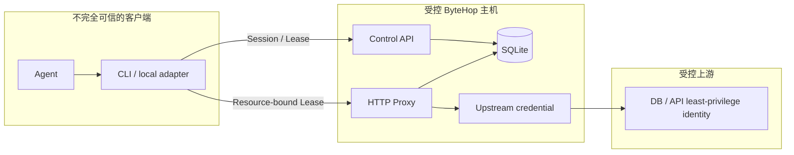

ByteHop 减少长期上游 credential 的暴露面，并让 Agent 访问可归属、可到期、可撤销。整体安全性由 ByteHop、部署环境和上游最小权限共同完成。

## 信任关系

ByteHop 主机、配置注入渠道、SQLite、TLS 私钥与上游固定 credential 必须被信任。若攻击者控制 ByteHop 进程或主机，就能以所有配置身份访问上游。

## 已实现的防护

- Lease 绑定 actor、Session、Resource 和过期时间，不能跨 Resource 使用；
- Web token 只在 HttpOnly Cookie，CLI token 保存在 `0600` 文件；
- SQLite 只保存 Session / Lease token 的 SHA-256 摘要；
- 客户端认证头、Cookie、代理身份头和协议特权头被剥离并重建；
- CLI 不自动跟随 redirect，防止 token、密码或请求体被重放到另一个 origin；
- 外部或越界的上游 `Location` 被剥离并标记 blocked；
- `connect` 只监听 loopback，并额外要求 192-bit 随机 capability path；
- 配置热重载是全量校验后的原子切换，不部分应用失败配置；
- 进程重启会撤销上一进程遗留的 active Session 与 Lease。

## 部署侧职责

- 固定上游账号本身权限过大；
- Agent 发出权限范围内但昂贵、错误或有隐私影响的查询；
- 上游返回内容中的 prompt injection；
- ByteHop 主机被攻破或环境变量被读取；
- ByteHop 主机、SQLite 和配置的备份恢复；
- 本地用户口令的创建、轮换和回收；
- 通用 HTTP / Elasticsearch 的 OpenAPI 契约被误认为运行时 allowlist。

## 数据最小化

ByteHop 不默认保存响应体和通用请求体。ClickHouse 保存有界 SQL 是为了定位长查询与追溯操作，但 SQL 可能含用户 ID、手机号等字面量。管理员应限制 Event 访问，并规划 retention / 脱敏，而不是无限保存。

## 最重要的部署原则

为每个 Resource 配置独立的最小权限身份。Lease、Event 和 UI 提供临时授权与追踪，数据库 / API 的权限负责控制最终可访问的数据和动作。
