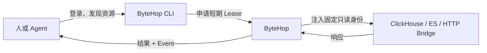

ByteHop 解决一个具体问题：**Agent 需要查生产数据或调用内部 API，但真实密码不应该散落在每台电脑、配置文件和对话上下文里。**

它把固定的最小权限凭证保留在服务端。用户登录后，只能为自己有权访问的资源申请短期 Lease；Agent 使用 Lease 访问资源，ByteHop 完成身份注入、转发和事件记录。

## 你可以先做什么

<Cards>
  <Card title="第一次使用" href="/docs/quickstart" description="登录团队实例，发现 Resource，并完成第一次受控查询。" />
  <Card title="先看边界" href="/docs/overview" description="理解 ByteHop 做什么、不做什么，以及它是否适合你。" />
  <Card title="理解 Lease" href="/docs/concepts" description="弄清 Session、Lease、Resource 和 Event 的关系。" />
</Cards>

## 按你的角色开始

| 角色 | 第一页 | 你会完成什么 |
| --- | --- | --- |
| 团队成员 | [第一次使用](./quickstart) | 登录、发现授权 Resource、完成首次调用 |
| Agent 使用者 | [给 Agent 使用](./using/agent-workflow) | 安装 Skill，建立稳定且不接触真实凭证的调用流程 |
| 管理员 | [安装 ByteHop](./administration/installation) | 部署单实例、接入 Resource、配置成员与权限 |
| 项目维护者 | [从源码构建](./development/source-build) | 构建、检查并运行真实 Compose 验收栈 |

## 当前覆盖范围

| 能力 | v0.1 状态 | 说明 |
| --- | --- | --- |
| ClickHouse HTTP | 可用 | 查询、SQL 历史、运行中查询与停止 |
| Elasticsearch HTTP | 可用 | 通过 HTTP API 搜索，凭证留在服务端 |
| 通用 HTTP API | 可用 | Basic、Bearer、API Key 和固定 Header 注入 |
| MongoDB | 通过 Bridge | 把少量允许的操作包装成 HTTP，不下发原生连接串 |
| Web 管理界面 | 可用 | 资源、Lease、Event、运行中操作和配置重载 |
| CLI | 可用 | 适合人、Agent 和脚本，支持稳定 JSON 输出 |

<Callout title="准确理解 v0.1">
  ByteHop 不是原生数据库协议代理，也不是完整 PAM、MCP Server 或 Secret Vault。它刻意把首版范围限定为 HTTP 数据面与短期授权。
</Callout>

下一步直接进入[第一次使用](./quickstart)，或者先阅读[产品边界](./overview)。
