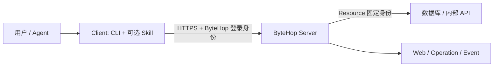

ByteHop 由两部分组成：团队运行一个 **Server**，每位使用者按需安装 **Client**。Server 保存 Resource、账号、权限和上游凭证；Client 是 CLI 和可选 Skill，只负责以当前用户身份连接 Server。

## 先选择你的角色

<Cards>
  <Card title="我是使用者" href="/docs/quickstart" description="团队已经有 ByteHop 地址和账号；登录后查看 Resource，并由人或 Agent 调用。" />
  <Card title="我是管理员" href="/docs/administration/installation" description="部署团队 Server，接入 Resource，创建用户并分配访问权限。" />
</Cards>

### 使用者需要什么

管理员应提供 Server 地址、独立用户名、初始密码和用途说明。只使用 Web 时无需安装 Client；需要终端、脚本或 AI Agent 调用时，再安装 CLI。Skill 是 Agent 的使用说明，不是 Server，也不会自动登录。

[开始连接已有实例](/docs/quickstart)

### 管理员需要做什么

管理员先用 Docker 部署 Server，再创建 Resource、账号与 Access policy。完成后把地址和账号交给成员；成员不应该自己猜 Server 地址、Resource 名称或数据库凭证。

[开始部署团队实例](/docs/administration/installation)

## 谁负责什么

| 部分 | 运行在哪里 | 负责什么 | 不负责什么 |
| --- | --- | --- | --- |
| ByteHop Server | 团队服务器 | 用户认证、Resource、Access policy、Lease、上游凭证注入、Event | 不安装到每个 Agent |
| Web | 由 Server 提供 | 登录、查看 Resource、访问和 Event；管理员观察与重载 | 不执行数据库查询 |
| CLI | 用户或 Agent 所在电脑 | 登录 Server、发现 Resource、执行 `request` / `connect` | 不保存上游凭证 |
| Skill | Agent 的 Skill 目录 | 教 Agent 正确使用 CLI 和配置流程 | 不包含 CLI、账号或 Resource 权限 |

## 常用入口

| 要完成的事 | 文档 |
| --- | --- |
| 连接团队已有实例 | [第一次使用](/docs/quickstart) |
| 安装 CLI 和 Skill | [安装客户端](/docs/using/client-installation) |
| 部署 Server | [管理员安装](/docs/administration/installation) |
| 用 Docker 启动 Server | [Docker 部署](/docs/administration/docker) |
| 创建账号 | [用户管理](/docs/administration/member-lifecycle) |
| 分配 Resource 权限 | [权限模型](/docs/administration/access-leases) |
| 让 AI 使用 CLI | [ByteHop Skill](/docs/using/agent-workflow) |
| 在飞书中使用 Hermes | [Hermes 与飞书](/docs/using/hermes) |

<Callout title="建议从一个只读 Resource 开始">
  先接入一项结果容易验证的只读能力，例如 ClickHouse 指标查询或订单查询 API。确认账号、权限、Event 和停止长查询都符合预期后，再增加其他 Resource。
</Callout>
