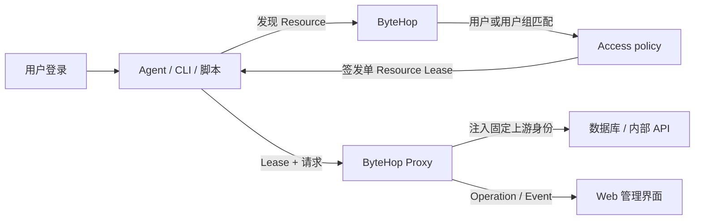
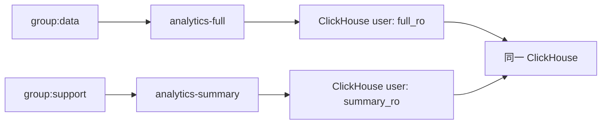

ByteHop 是一个**面向 AI Agent 的开源自托管访问网关**。它部署在 Codex、Claude、CLI、脚本与数据库、内部 API 之间；客户端把请求发给 ByteHop，网关完成用户授权、短期访问、上游凭证注入、请求转发和记录。

## 它解决什么

常见做法是把 ClickHouse 密码写进各自的 Agent 配置，把 MongoDB 连接串贴进对话，再把内部 API 的 Cookie 放进本地脚本。这种方式能很快跑通一次调用，但资源增加或使用者变化后，会反复遇到相同问题：

- 同一份数据库账号或 API Key 被复制到多台机器；
- 不同用户需要不同的数据范围，却只能继续分发更多连接信息；
- Agent 不知道当前账号可以使用哪些资源，只能靠提示词猜名称和调用方式；
- 查询卡住后，很难定位是哪次 Agent 调用，也没有统一入口停止；
- 凭证轮换或权限变化后，还要逐台修改客户端。

使用 ByteHop 后，变化的是访问方式：

| 原来的做法 | 使用 ByteHop |
| --- | --- |
| 每台机器保存数据库账号、Cookie 或 API Key | 上游连接与凭证只配置在网关 |
| 使用者自行寻找连接方式 | 登录后只发现当前用户获准的 Resource |
| 数据范围与账号分发混在一起 | Access policy 决定谁可用哪个 Resource，上游身份决定最终数据范围 |
| Agent 直接连接上游 | Agent、CLI 和脚本统一请求 ByteHop，由网关注入凭证并转发 |
| 长查询只能去数据库侧排查 | Web 显示当前 Operation；ClickHouse 可查看 SQL 并停止单次查询 |

## 一次请求怎样经过网关

实际调用包含四个动作：

1. 管理员在数据库或 API 侧创建固定的最小权限身份；
2. ByteHop 把这个上游入口和身份配置成一个 Resource；
3. Access policy 指定哪些用户或用户组可以发现并使用它；
4. CLI 在调用时自动申请短期 Lease，请求经过网关转发，结束后留下 Event。

Lease 是 ByteHop 的临时访问凭证，不是数据库临时账号。数据库或 API 看到的仍是该 Resource 绑定的固定最小权限身份；客户端不会收到这个上游身份的密码或 Token。

## 不同用户怎样获得不同数据范围

ByteHop 把 **Resource 作为授权单元**。例如同一个 ClickHouse 可以配置两个固定上游身份：

`group:data` 只能发现 `analytics-full`，`group:support` 只能发现 `analytics-summary`。ByteHop 不解析 SQL 来猜数据权限；ClickHouse 用户、Elasticsearch role、MongoDB Bridge 或内部 API 继续控制表、索引、集合、租户和读写操作。

管理能力与数据访问能力彼此独立。`admin: true` 允许查看系统状态和应用配置，但不会自动授予任何 Resource。完整规则见[权限模型](/docs/administration/access-leases)。

## 为什么选择 HTTP

ClickHouse 和 Elasticsearch 已有成熟 HTTP API，内部服务天然使用 HTTP；MongoDB、CLI 或脚本也可以通过受限 Bridge 暴露少量明确操作。

统一使用 HTTP 后，`curl`、ByteHop CLI、Codex、Claude 和现有脚本可以使用同一套发现、授权与调用流程。新增 Resource 时，不需要为每个 Agent 单独实现协议适配或分发连接凭证。

核心数据面不依赖 MCP。能运行 CLI 或访问 HTTP 的 Agent 都可以使用 ByteHop；已有 MCP Server 也可以把 ByteHop 当作上游访问网关，而不需要把权限和凭证逻辑重新实现到每个 MCP Tool 中。

ByteHop v0.1 不提供 MongoDB、PostgreSQL、MySQL 或 SSH 的原生协议代理。需要这些能力时，可以先通过职责明确的 HTTP Bridge 接入，或者继续使用现有原生访问平台。支持情况见[适用场景](/docs/evaluate/use-cases)和[与其他方案比较](/docs/evaluate/comparison)。

## 为什么还需要 ByteHop Skill

Gateway 和 CLI 已经可以独立工作，Skill 不是服务端依赖。它解决的是不同 Agent 的使用习惯：CLI 只提供稳定命令，不会主动告诉每一种 Agent 应该先发现 Resource、读取哪份调用说明、怎样修改 YAML 或什么时候停止重试。

ByteHop Skill 是 CLI 上方的轻量适配层：

- 管理员描述 Resource，Agent 按当前配置结构修改 YAML 并调用 CLI 校验；
- 用户描述数据任务，Agent 自行完成发现、调用说明读取和受控调用；
- Codex、Claude、Hermes 等 Agent 共享同一套行为，不需要 Gateway 为每个 Agent 添加安装逻辑；
- Skill 随 Release 版本化，但不携带真实 Resource、业务 Schema 或凭证。

详细流程见 [ByteHop Skill](/docs/using/agent-workflow)。通过飞书使用 Hermes 时，参见[在 Hermes 与飞书中使用](/docs/using/hermes)。

## 核心设计

- **凭证集中保管**：上游固定身份只存在于服务端；
- **Resource 明确能力**：一个名称对应一种用途、一组上游权限和可选契约；
- **Lease 控制时效**：每次访问绑定用户、Resource 与过期时间，可随时撤销；
- **上游落实数据权限**：数据库和 API 继续负责表、索引、集合、业务动作与配额；
- **Agent 按需发现**：先列出可用 Resource，再读取单个 Resource 的调用说明，减少上下文占用；
- **调用可追踪**：用 actor、Agent ID、Task ID、request ID 和 query ID 关联一次工作；
- **运行可观察、可停止**：用户在 My access 查看自己的运行请求，管理员在 Sessions 查看全部 ByteHop Operation；ClickHouse 可显示实时 SQL，并单独停止卡住的查询而不撤销 Lease；
- **配置可以在线更新**：YAML 先检查、预览差异，再原子热更新；不受影响的 Session、Lease 和运行请求继续工作。

运行列表只覆盖当前 ByteHop 实例正在代理的请求，不枚举绕过网关发起的数据库查询。ClickHouse Stop 会分别返回本地取消与远端 `KILL QUERY` 的结果，详见[运行中操作与 Event](/docs/administration/operations-audit)。

## 适合怎样开始

先接入一个高频只读场景，例如 ClickHouse 指标查询或内部订单 API。验证凭证不下发、用户权限、短期 Lease、Event 和停止长查询后，再逐个增加 Resource。

使用已经部署的实例时，从[第一次使用](/docs/quickstart)开始；让 Agent 稳定配置或调用时，安装 [ByteHop Skill](/docs/using/agent-workflow)；负责部署时，从[管理员安装](/docs/administration/installation)和[接入 Resource](/docs/administration/resource-onboarding)开始。
