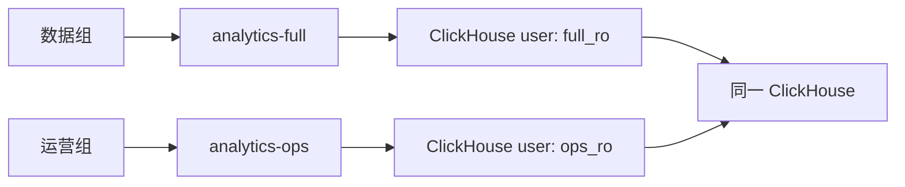

一个 Resource 是 ByteHop 对外暴露的最小能力单元：**一个 HTTP(S) upstream、一种资源类型、一组固定最小权限 credential，以及可选的 OpenAPI 契约。**

```yaml
resources:
  analytics:
    description: "Production analytics, read only"
    kind: clickhouse
    upstream: "https://clickhouse.internal:8443"
    credential:
      basic:
        username: bytehop_analytics_ro
        password: "${CLICKHOUSE_ANALYTICS_PASSWORD}"
```

## 不要用一个高权限账号覆盖所有范围

如果数据团队可以看全量表，运营团队只能看聚合表，应在上游创建两个不同权限的固定身份，并在 ByteHop 里配置为两个 Resource：



ByteHop 负责“谁可领取哪个 Resource 的短期 Lease”；数据库负责表、行、配额与只读约束。把边界分开后，增加新数据库类型不需要在网关里重新发明每一种权限系统。

## 支持的 credential

| 类型 | 配置 | 常见用途 |
| --- | --- | --- |
| Basic | `credential.basic` | ClickHouse、内部 API |
| Bearer | `credential.bearer` | Elasticsearch 或内部 API token |
| API Key | `credential.api_key` | 指定 header 名和值 |
| 单 Header | `credential.header` | 自定义认证头 |
| 附加 Headers | `credential.headers` | 在主认证外补充固定 Cookie 等 |

客户端传来的 `Authorization`、Cookie、代理头、ClickHouse 用户头和 Elasticsearch run-as 头会被剥离，再由 ByteHop 重建上游身份。响应中的 `Set-Cookie` 也不会转发给 Agent。

## OpenAPI 的作用

给 HTTP Resource 配置 `openapi` 后，`bytehop resources <name>` 会显示操作、路径、摘要和输入示例，减少 Agent 猜接口的成本。

OpenAPI 在 v0.1 是**发现契约**，不是运行时 allowlist。真正允许的路径和动作仍必须由上游固定身份、Bridge 或 API 本身限制。
